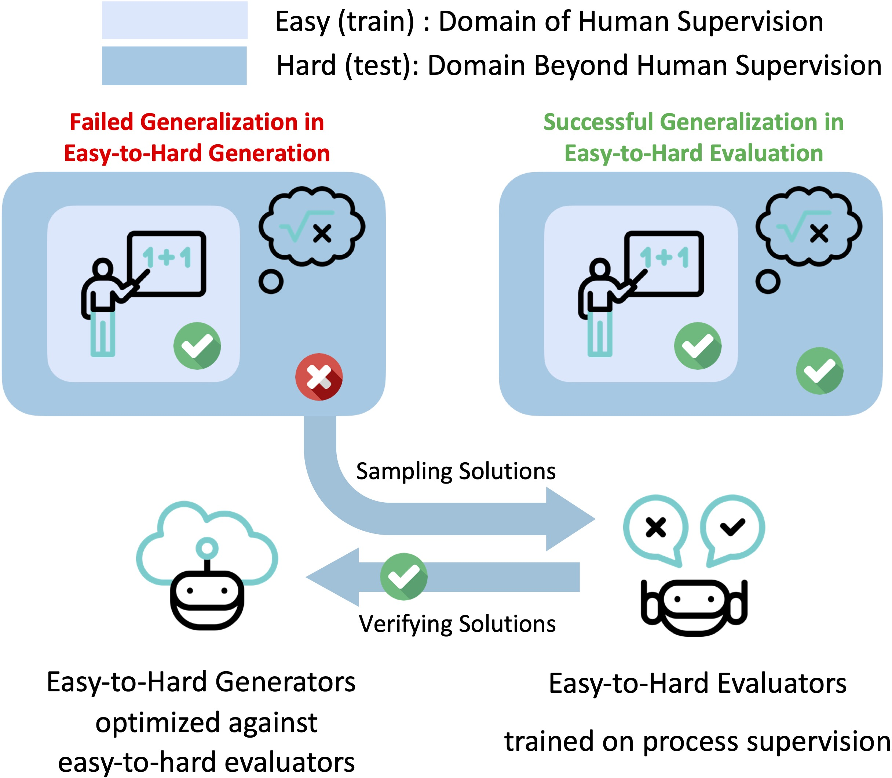

<div align="center">
    
</div>

<div align="center">

# Easy-to-Hard Generalization

</div>

<div align="center">
    
</div>

Easy-to-Hard Generalization: Scalable Alignment Beyond Human Supervision

## Downloading pre-tuned PRM800K / MetaMath models

We provide model checkpoints for the supervised fine-tuned models and reward models. The current list of models includes:

- SFT models:

  - [`llemma-7b-sft-prm800k-level-1to3-hf`](https://huggingface.co/ScalableMath/llemma-7b-sft-prm800k-level-1to3-hf)
  - [`llemma-7b-sft-metamath-level-1to3-hf`](https://huggingface.co/ScalableMath/llemma-7b-sft-metamath-level-1to3-hf)

- Reward models:

  - [`llemma-7b-oprm-prm800k-level-1to3-hf`](https://huggingface.co/ScalableMath/llemma-7b-oprm-prm800k-level-1to3-hf)
  - [`llemma-7b-prm-prm800k-level-1to3-hf`](https://huggingface.co/ScalableMath/llemma-7b-prm-prm800k-level-1to3-hf)
  - [`llemma-7b-orm-prm800k-level-1to3-hf`](https://huggingface.co/ScalableMath/llemma-7b-orm-prm800k-level-1to3-hf)
  - [`llemma-7b-prm-metamath-level-1to3-hf`](https://huggingface.co/ScalableMath/llemma-7b-prm-metamath-level-1to3-hf)

## Reproduction

Please check the [examples](/examples/) for the training scripts and [data](/data/) for the data preparation.

### Citation

Please consider citing our work if you use the data or code in this repo.

```
@article{sun2024easy,
  title={Easy-to-Hard Generalization: Scalable Alignment Beyond Human Supervision},
  author={Sun, Zhiqing and Yu, Longhui and Shen, Yikang and Liu, Weiyang and Yang, Yiming and Welleck, Sean and Gan, Chuang},
  journal={arXiv preprint arXiv:2403.09472},
  year={2024}
}
```

#### Below is copied from the Gpt-Accelera GitHub repository in 2024-03-19

# gpt-accelera

Simple and efficient pytorch-native transformer training and inference (batched).

`gpt-accelera` is a codebase based on [`gpt-fast`](https://github.com/pytorch-labs/gpt-fast/tree/main) -- the state-of-the-art pytorch-native tensor-parallel implementation of transformer text generation that minimizes latency (i.e. batch size=1) -- with the following improvements:

Featuring:

- Batched (i.e., batch size > 1) inference with compiled graph (i.e., torch.compile)
- 2-D parallelism (Tensor-Parallel (TP) + Fully Sharded Data Parallel (FSDP)) training with mixed precision (i.e., torch.cuda.amp)
- Supports for both LLaMA and DeepSeek models
- Supports training policy models with Supervised Fine-Tuning (SFT)
- Supports training reward models (RM) with pointwise and pairwise losses
- Supports on-policy (PPO) and off-policy (DPO) reinforcement learning (RL) training
- All the training can be performed with full fine-tuning for `7b-34b LLaMA/Llemma` models

Shared features w/ `gpt-fast`:

- Very low latency (on inference, batched inference, SFT, and PPO)
- No dependencies other than PyTorch and sentencepiece
- int8/int4 quantization (for inference and ref_policy / reward_model in PPO)
- Supports Nvidia and AMD GPUs (?, TODO: test the codebase on AMD)

Following the spirit of `gpt-fast`, this repository is NOT intended to be a "framework" or "library", but to show off what kind of performance you can get with native PyTorch. Please copy-paste and fork as you desire.

## Installation

Install `torch==2.2.0`, `sentencepiece`, and `huggingface_hub`:

```bash
pip install sentencepiece huggingface_hub
```

## Downloading Weights

Models tested/supported

```
meta-llama/Llama-2-7b-chat-hf
meta-llama/Llama-2-13b-chat-hf
meta-llama/Llama-2-70b-chat-hf
codellama/CodeLlama-7b-Python-hf
codellama/CodeLlama-34b-Python-hf
EleutherAI/llemma_7b
EleutherAI/llemma_34b
deepseek-ai/deepseek-llm-7b-base
deepseek-ai/deepseek-coder-6.7b-base
deepseek-ai/deepseek-math-7b-base
```

## Benchmarks

TODO: Add benchmarks

## Running reference methods

TODO: Add reference methods

## License

Following `gpt-fast`, `gpt-accelera` is licensed under the BSD 3 license. See the LICENSE file for details.

### Community

The `gpt-accelera` codebase is developed during the research and development of the [Easy-to-Hard Generalization](https://github.com/Edward-Sun/easy-to-hard/tree/main) project.

### Citation

Please consider citing our work if you use the data or code in this repo.

```
@misc{gpt_accelera,
  author = {Zhiqing Sun },
  title = {GPT-Accelera: Simple and efficient pytorch-native transformer training and inference (batched)},
  year = {2024},
  publisher = {GitHub},
  journal = {GitHub repository},
  howpublished = {\url{https://github.com/Edward-Sun/gpt-accelera}}
}
```

### Acknowledgements

We thank the authors of following works for their open-source efforts in democratizing large language models.

- The compiled generation part of `gpt-accelera` is adopted from [`gpt-fast`](https://github.com/pytorch-labs/gpt-fast/tree/main)
- The RL part of `gpt-accelera` is adopted from [`SALMON`](https://github.com/IBM/SALMON), which is from [`alpaca_farm`](https://github.com/tatsu-lab/alpaca_farm).
- The tokenization part of `gpt-accelera` is adopted from [`transformers`](https://github.com/huggingface/transformers/tree/main)
